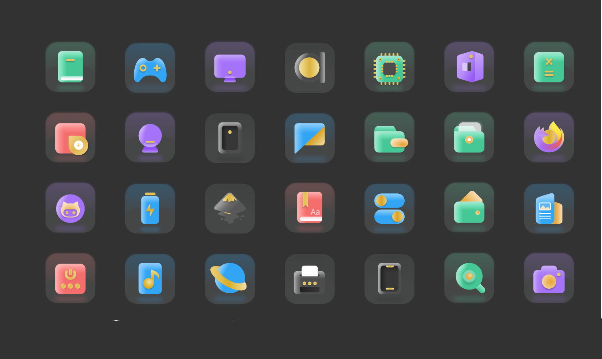

# pearOS-Default-Icons
This is the default pearOS icon-pack repository. Based on the Bubble-dark icon pack

# Installation
- open a terminal and run the `install.sh`

# Compatibility
- KDE
- Manjaro
- Ubuntu
- Some other major Linux/ BSD distros

# Copyright
- This icon pack is licensed under the GNU Public License v3
- The installation script author is Alexandru Balan
